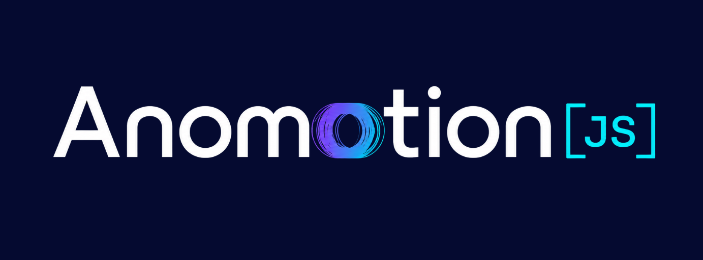

# 🎨 AnomotionJS

> Beautiful text animations for the web. Offline-first. Framework-agnostic. Open-source.

[](https://www.npmjs.com/package/@eldrex/anomotionjs-core)
[](https://bundlephobia.com/package/@eldrex/anomotionjs-core)
[](https://github.com/EldrexDelosReyesBula/AnomotionJS/blob/main/LICENSE)

AnomotionJS is a high-performance typography animation engine designed to create fluid, hardware-accelerated text animation pipelines across DOM/CSS, Canvas 2D, Three.js WebGL, and WebGPU backends.

---

## 📦 Monorepo Packages

| Package | Description | Version Badge | Installation Command |
| :--- | :--- | :--- | :--- |
| **[`@eldrex/anomotionjs-core`](https://www.npmjs.com/package/@eldrex/anomotionjs-core)** | Core animation engine, timeline, and scheduler | [](https://www.npmjs.com/package/@eldrex/anomotionjs-core) | `npm install @eldrex/anomotionjs-core` |
| **[`@eldrex/anomotionjs-text`](https://www.npmjs.com/package/@eldrex/anomotionjs-text)** | Low-level text parser, layout engine, and glyph generator | [](https://www.npmjs.com/package/@eldrex/anomotionjs-text) | `npm install @eldrex/anomotionjs-text` |
| **[`@eldrex/anomotionjs-renderer-2d`](https://www.npmjs.com/package/@eldrex/anomotionjs-renderer-2d)** | DOM and Canvas 2D renderers | [](https://www.npmjs.com/package/@eldrex/anomotionjs-renderer-2d) | `npm install @eldrex/anomotionjs-renderer-2d` |
| **[`@eldrex/anomotionjs-renderer-3d`](https://www.npmjs.com/package/@eldrex/anomotionjs-renderer-3d)** | Three.js WebGL typography renderer | [](https://www.npmjs.com/package/@eldrex/anomotionjs-renderer-3d) | `npm install @eldrex/anomotionjs-renderer-3d` |
| **[`@eldrex/anomotionjs-renderer-gpu`](https://www.npmjs.com/package/@eldrex/anomotionjs-renderer-gpu)** | High performance WebGPU typography renderer | [](https://www.npmjs.com/package/@eldrex/anomotionjs-renderer-gpu) | `npm install @eldrex/anomotionjs-renderer-gpu` |
| **[`@eldrex/anomotionjs-physics`](https://www.npmjs.com/package/@eldrex/anomotionjs-physics)** | Verlet physics integration for text layout | [](https://www.npmjs.com/package/@eldrex/anomotionjs-physics) | `npm install @eldrex/anomotionjs-physics` |
| **[`@eldrex/anomotionjs-cache`](https://www.npmjs.com/package/@eldrex/anomotionjs-cache)** | IndexedDB caching bootloader for offline-first operations | [](https://www.npmjs.com/package/@eldrex/anomotionjs-cache) | `npm install @eldrex/anomotionjs-cache` |
| **[`@eldrex/anomotionjs-plugins`](https://www.npmjs.com/package/@eldrex/anomotionjs-plugins)** | Plugin registry and standard animation helpers | [](https://www.npmjs.com/package/@eldrex/anomotionjs-plugins) | `npm install @eldrex/anomotionjs-plugins` |

---

## 🚀 Quick Start

### Installation

```bash
npm install @eldrex/anomotionjs-core @eldrex/anomotionjs-renderer-2d
```

### Basic Usage

```javascript
import Anomotion from '@eldrex/anomotionjs-core';
import '@eldrex/anomotionjs-renderer-2d'; // Auto-registers 'dom' and 'canvas' adapters

Anomotion.create('#hero-title', {
  text: 'ANOMOTION',
  effect: 'wave',
  duration: 1.8,
  stagger: 50,
  easing: 'easeOutElastic'
});
```

---

## ⚡ Key Features

* **🎨 Unified Renderers:** Animate seamlessly across HTML/DOM, Canvas 2D, Three.js (WebGL), and WebGPU.
* **📦 Light & Tree-shakeable:** Core package is under 12KB gzipped.
* **🔌 Extensible Plugins:** Verlet physics engine, particles, and custom layout rules.
* **📴 Offline-First Bootloader:** Intercepts scripts via IndexedDB to boot and run without network dependency.

---

## 📖 Support & Community

* **Documentation:** [anomotionjs.vercel.app](https://anomotionjs.vercel.app/)
* **Playground:** [anomotionjs.vercel.app/playground/](https://anomotionjs.vercel.app/playground/)
* **Contributing:** Check out our [CONTRIBUTING.md](./.github/CONTRIBUTING.md) to get started.
* **PayPal:** [Support Eldrex Bula via PayPal](https://www.paypal.com/paypalme/eldrexbula)
* **Ko-fi:** [Support Eldrex Bula on Ko-fi](https://ko-fi.com/landecsorg/)

---

## 📄 License

MIT © AnomotionJS Contributors
