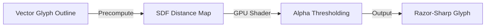

# High Performance Text Rendering in WebGL

Text rendering is one of the most deceptively complex challenges in computer graphics. Unlike rendering 3D meshes or bitmaps, text requires sub-pixel clarity at arbitrary scales and rotations without dragging down frame rates. 

This article explores the modern GPU-accelerated techniques used to render high-performance typography in WebGL, including Signed Distance Fields (SDF), Multi-channel Signed Distance Fields (MSDF), and GPU Instancing.

---

## 1. The Bottlenecks of Traditional Text Rendering

In traditional 2D web environments, browsers render text by rasterizing vector glyph shapes into CPU memory and uploading them as bitmap textures to the GPU. 

### Why this fails in WebGL:
1. **Texture Bandwidth limits:** Uploading large textures or updating them frequently (e.g. during animations) bottlenecks the CPU-to-GPU bridge.
2. **Pixelation and Blurring:** If you scale a rasterized glyph texture up, it becomes pixelated. If you scale it down, it aliasing occurs.
3. **Draw Call Overhead:** Drawing each character as a separate draw call quickly bottlenecks the WebGL pipeline.

---

## 2. Signed Distance Fields (SDF)

Popularized by Valve Software in 2007, Signed Distance Fields (SDF) revolutionized vector rendering on the GPU.

### The Concept:
Instead of storing raw pixel colors, an SDF texture stores the **distance** from the pixel to the nearest edge of the glyph boundary:
- Pixels **inside** the glyph store positive values ($> 0.5$).
- Pixels **outside** the glyph store negative values ($< 0.5$).
- The boundary edge lies exactly at $0.5$.



### The Shader Logic:
In the fragment shader, we use the `smoothstep` function to sample the distance field and resolve a crisp vector edge dynamically at any scale factor:

```glsl
precision mediump float;
varying vec2 vUv;
uniform sampler2D uTexture;
uniform vec3 uTextColor;

void main() {
  float distance = texture2D(uTexture, vUv).r;
  // Dynamic anti-aliasing edge thresholding
  float alpha = smoothstep(0.48, 0.52, distance);
  gl_FragColor = vec4(uTextColor, alpha);
}
```

- **Pros:** Crisp edges at infinite zoom levels; tiny texture footprint.
- **Cons:** Sharp corners become rounded or distorted because a single channel cannot represent multi-directional vector corners.

---

## 3. Multi-channel Signed Distance Fields (MSDF)

Multi-channel Signed Distance Fields (MSDF) solve the corner rounding problem of standard SDFs by utilizing three color channels (Red, Green, Blue) to store distance metrics from three independent vector planes.

### How it works:
By combining distance metrics across multiple channels, the GPU fragment shader can reconstruct sharp vector corners and curves simultaneously by computing the median value of the channels:

```glsl
precision mediump float;
varying vec2 vUv;
uniform sampler2D uTexture;
uniform vec3 uTextColor;

float median(float r, float g, float b) {
  return max(min(r, g), min(max(r, g), b));
}

void main() {
  vec3 sample = texture2D(uTexture, vUv).rgb;
  float sigDist = median(sample.r, sample.g, sample.b) - 0.5;
  // Calculate screen-space derivative for sharp anti-aliasing
  float afwidth = length(vec2(dFdx(sigDist), dFdy(sigDist))) * 0.7071;
  float alpha = smoothstep(-afwidth, afwidth, sigDist);
  
  gl_FragColor = vec4(uTextColor, alpha);
}
```

This is the exact technique used under-the-hood by `@eldrex/anomotionjs-renderer-3d` via **Troika Three Text**, enabling high-resolution 3D text in WebGL with sub-pixel alignment.

---

## 4. Glyph Instancing and Texture Atlases

To render paragraphs containing thousands of characters at 60fps, we must minimize CPU draw calls. This is achieved by combining **Glyph Instancing** with a **Texture Atlas**:

1. **Texture Atlas:** All glyphs of a font family are packed into a single texture map.
2. **Instanced Drawing:** A single draw call renders all instances of a generic quad mesh. We pass per-character coordinates, offsets, and atlas UV bounds as instanced attributes to the vertex shader.

This reduces the WebGL draw call count to exactly **one**, unlocking the capability to animate thousands of characters concurrently.
