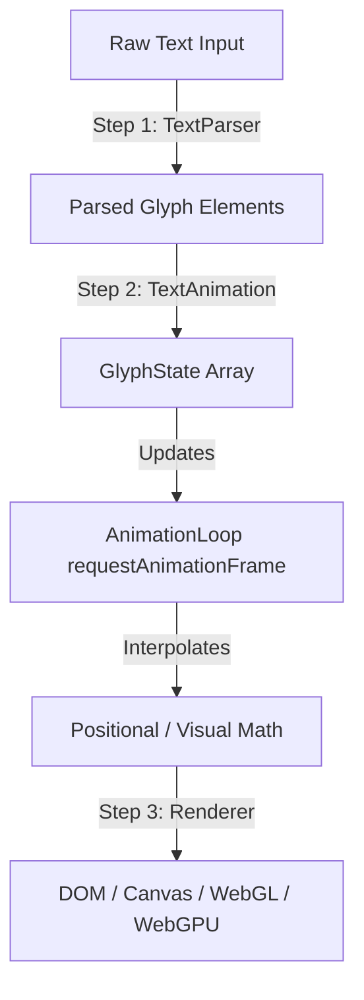

# Core Concepts

AnomotionJS splits typography animation into a highly optimized, three-stage architecture. This decoupled design enables lightweight updates, low CPU overhead, and the ability to render the same animation state calculations across DOM, Canvas 2D, WebGL, or WebGPU backends.



---

## 1. The Splits Model (Parsing & Segmentation)

To animate text character-by-character or word-by-word, the input text must be segmented.
- When an animation is initialized, the `TextParser` class parses the raw text.
- For the DOM renderer, it injects structured HTML `<span>` wraps for words (`.anomotion-word`) and characters (`.anomotion-glyph`).
- For non-DOM renderers (like Canvas or Three.js), it parses the text into memory arrays of glyph character metrics, avoiding unnecessary DOM allocations.

This segmentation ensures that each character has a defined index ($i$), which is used as the index offset for staggered timelines.

---

## 2. The Animation Loop & Ticker

At the core of the engine resides the `AnimationLoop` (running on a single global instance).
- It runs a high-performance rendering loop synchronized with the screen's refresh rate using `requestAnimationFrame`.
- Instead of using heavy, multi-layered CSS transitions or multiple timers, it updates all registered `TextAnimation` instances inside a single, unified tick.
- It tracks frame deltas, monitors runtime FPS, and triggers updates with sub-millisecond precision.

---

## 3. The Glyph State & Mathematical Equations

Each character's current state is represented by a `GlyphState` object:
```typescript
interface GlyphState {
  originalX: number; // Anchor X coordinate
  originalY: number; // Anchor Y coordinate
  x: number;         // Current offset X coordinate
  y: number;         // Current offset Y coordinate
  scaleX: number;    // Width multiplier
  scaleY: number;    // Height multiplier
  rotation: number;  // Angular rotation degrees
  opacity: number;   // Visual alpha transparency (0 to 1)
  color?: string;    // Custom hex/rgba override
}
```

During each loop update, the engine calculates the progressive timeline index ($t$) for each character based on the duration, ease function, and stagger delay. It then feeds this value into parametric equations to calculate the output offsets.
- Developers can configure built-in effects (like `wave`, `explode`, or `glitch`).
- Alternatively, you can supply custom parametric equations via `customEquation(t, i)` to calculate values mathematically (e.g., creating a spiral or a vortex).

---

## 4. Renderers Handoff

Once the states are calculated, the engine hands off the updated `GlyphState` array to the selected `Renderer` implementation.
- The renderer is only responsible for drawing: writing values to CSS styles (DOM), drawing shapes (Canvas 2D), or updating vertex coordinates in shaders (WebGL/WebGPU).
- This separation of calculation and rendering guarantees cross-framework compatibility and extreme rendering flexibility.
