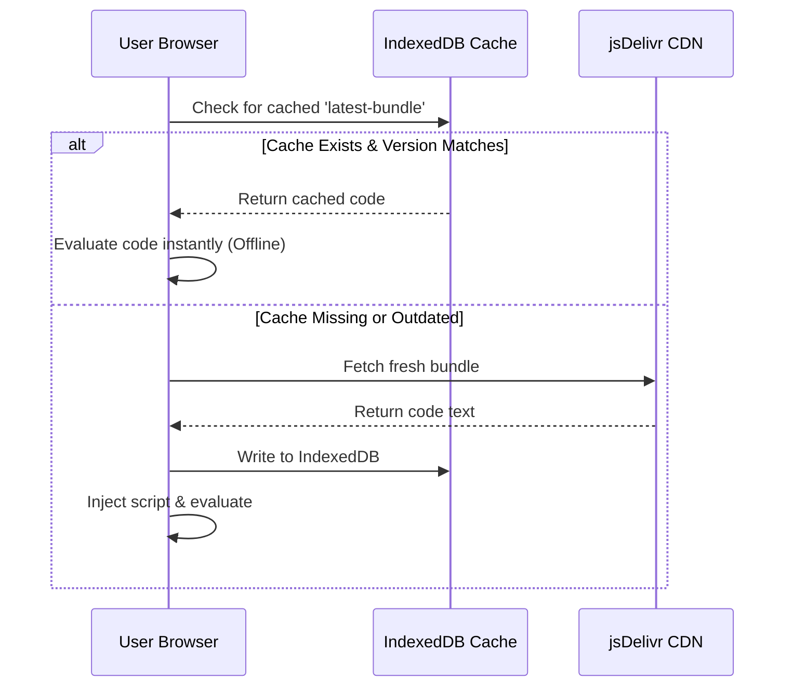

# Offline & Caching Guide

AnomotionJS features a 1KB, zero-dependency IndexedDB bootloader designed for offline-first web applications. It cache-evaluates compiled package assets locally, completely bypassing network roundtrips on repeat visits while keeping assets up to date.

---

## 1. How the Bootloader Works

When a user visits your website:



---

## 2. Using the Caching Bootloader

To set up the offline bootloader, include the cache script inside the `<head>` of your HTML document, then call `AnomotionBootloader.ready()`:

```html
<!DOCTYPE html>
<html lang="en">
<head>
  <!-- Load the 1KB Bootloader -->
  <script src="https://cdn.jsdelivr.net/npm/@eldrex/anomotionjs-cache@1.0.1/dist/index.js"></script>
</head>
<body>
  <div id="hero">OFFLINE CORE</div>

  <script>
    // ready(version: string, customCdnUrl?: string)
    AnomotionBootloader.ready('1.0.1')
      .then(() => {
        // Core is now loaded and available globally
        Anomotion.create('#hero', {
          effect: 'float',
          duration: 2.0
        });
      })
      .catch((err) => {
        console.error('Anomotion failed to load offline or online:', err);
      });
  </script>
</body>
</html>
```

---

## 3. Cache Invalidation and Versioning

The bootloader maps assets using a unique string signature. When you bump your package version (e.g. from `1.0.1` to `1.0.2`):
- Update the version string in `AnomotionBootloader.ready('1.0.2')`.
- The bootloader will detect the mismatch, discard the outdated IndexedDB record, fetch the fresh build from the CDN, and cache the new version.
- If the client device is offline and a version mismatch occurs, the bootloader logs a warning and falls back to running the existing cached version rather than failing, ensuring maximum uptime.
